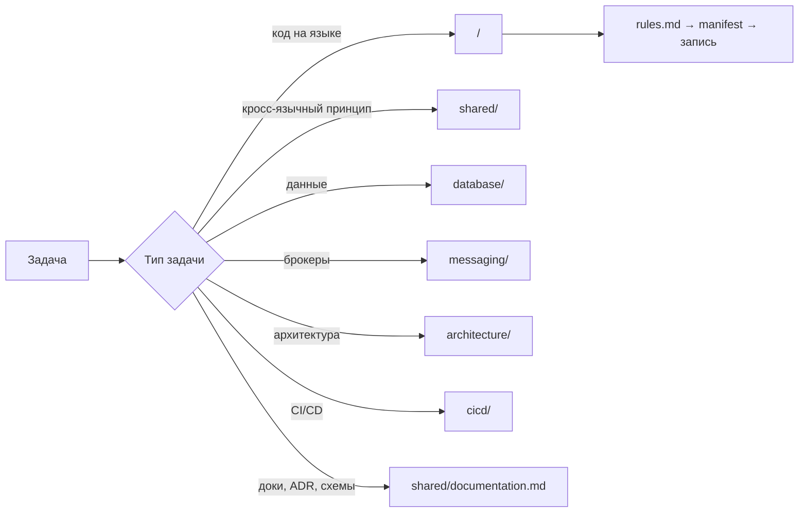

# awesome-coding

> **Для ИИ-агентов:** начните с [AGENTS.md](AGENTS.md) — роутер «задача → куда смотреть».
> Путь: `AGENTS.md` → раздел (`go/`, `shared/`, `database/`, …) → конкретная запись.
> Без клона файлы доступны по ссылкам GitHub/raw; поиск по каталогу — в `index/<section>.yaml`.

Библиотека сниппетов, паттернов и правил для **кодинг-агентов** (и людей).
Структурирована по языкам: **Go, TypeScript, JavaScript, Python, C, Bash, C#, Kotlin** +
разделы **Unity** (кроссплатформенные и Android-игры, HLSL), **shared** (кросс-языковые принципы),
**database** (PostgreSQL, Redis), **messaging** (Kafka, RabbitMQ), **cicd** (GitHub/GitLab, Docker, k8s).

## Почему agent-first

Основной потребитель репозитория — LLM-агент, а не человек. Отсюда дизайн:

- **Предсказуемая структура и имена** — агент читает только нужное, а не всё подряд.
- **YAML frontmatter** у каждой записи — метаданные для поиска (теги, версия, статус).
- **Высокая плотность сигнала** — «когда использовать / когда нет», Do/Don't-пары, pitfalls.
- **Закреплённые версии языков** — агент не пишет устаревшие идиомы.
- **`AGENTS.md`** — короткий «роутер» для агента, а не дамп контента.

## Роутинг агента

Как агент находит нужную запись (полный роутер — в `AGENTS.md`):



## Структура

```
awesome-coding/
├── AGENTS.md                  # точка входа для агента (роутер)
├── Makefile                   # make validate — валидация репо
├── tools/
│   └── validate.py            # валидатор: frontmatter, manifest, ссылки
├── docs/
│   ├── FORMAT.md              # спецификация формата записей
│   ├── CONTRIBUTING.md
│   └── adr/                   # ADR — архитектурные решения репозитория
├── index/
│   ├── manifest.yaml          # шапка каталога: версии языков
│   └── <section>.yaml         # записи раздела (go, bash, shared, …)
├── go/                        # языковой раздел (эталонный)
│   ├── README.md              # версия, конвенции, quick-reference
│   ├── rules.md               # guardrails: do/don't (✅/❌)
│   ├── idioms.md              # идиоматичный Go
│   ├── decisions.md           # таблицы решений: что выбрать и когда
│   ├── snippets/              # готовые сниппеты
│   └── patterns/              # архитектурные/дизайн-паттерны
├── architecture/              # языконезависимая архитектура и DDD
│   ├── decisions.md           # какой уровень DDD / какая архитектура для проекта
│   ├── ddd/                   # tactical (entity, VO, aggregate, …) + strategic (bounded contexts)
│   └── patterns/              # layered, hexagonal, modular monolith, microservices, CQRS, ES, event-driven
├── typescript/                # (аналогичная структура)
├── javascript/
├── python/
├── c/
├── bash/
├── csharp/                    # .NET 10 / C# 14
├── kotlin/                    # Kotlin 2.3 (JVM/Android)
├── unity/                     # Unity 6.3 LTS: кроссплатформа + Android
│   └── shaders/               # HLSL (URP)
├── shared/                    # кросс-языковые концепции (11 тем)
├── database/                  # PostgreSQL 18 + Redis 8
├── messaging/                 # Kafka 4.3, RabbitMQ 4.3
└── cicd/                      # GitHub Actions, GitLab CI, Docker, Kubernetes
```

## Версии (закреплено и проверено на 2026-09-06)

| Технология | Версия | Fallback |
|---|---|---|
| Go | 1.27 | 1.26 |
| TypeScript | 7.0 | 6.x |
| JavaScript | ES2025 | ES2024 |
| Python | 3.14 | 3.13 |
| C | C23 (ISO 9899:2024) | C17 |
| Bash | 5.3 | 5.2 |
| C# | .NET 10 (LTS) / C# 14 | .NET 9 / C# 13 |
| Kotlin | 2.3 | 2.2 |
| Unity | 6.3 LTS (6000.3.x) | 6.0 LTS |
| PostgreSQL | 18 (18.6) | 17 |
| Redis | 8 (8.10.1) | 8.0 |
| Kafka | 4.3 (4.3.1) | 4.2 |
| RabbitMQ | 4.3 (4.3.5) | 4.0 |

## Для контрибьюторов

- Формат записей: [docs/FORMAT.md](docs/FORMAT.md)
- Правила контрибьюции: [docs/CONTRIBUTING.md](docs/CONTRIBUTING.md)
- Валидация: `make validate` (frontmatter, manifest, ссылки)

## Статус разделов

| Раздел | Статус |
|---|---|
| `go/` | ядро: snippets, patterns, rules, idioms, decisions |
| `architecture/` | полный: DDD (tactical + strategic) + 7 архитектурных паттернов |
| `csharp/` | полный: snippets, patterns, rules, idioms, decisions (.NET 10 / C# 14, код компилируется) |
| `unity/` | полный: snippets, patterns, rules, idioms, decisions + HLSL-шейдеры (6.3 LTS, Android) |
| `kotlin/` | полный: rules, idioms, decisions, 4 сниппета (2.3; корутины — скомпилированы и выполнены, Ktor — скомпилирован) |
| `shared/` | полный: 11 кросс-языковых концепций |
| `database/` | полный: PostgreSQL 18 + Redis 8 (rules, decisions, 5 сниппетов; SQL прогнан на живом PG 18.6) |
| `messaging/` | полный: Kafka 4.3 + RabbitMQ 4.3 (decisions, 2 сниппета; Go-код скомпилирован) |
| `cicd/` | полный: GitHub Actions, GitLab CI, Docker, Kubernetes |
| `typescript/` | полный: rules, idioms, decisions, 5 сниппетов (tsc 7.0.2 strict — код проверен) |
| `javascript/` | полный: rules, idioms, decisions, 4 сниппета (node 22 — код выполнен, node:test 5/5) |
| `python/` | полный: rules, idioms, decisions, 6 сниппетов (Python 3.14.7 — код выполнен, pytest) |
| `c/` | полный: rules, idioms, decisions, 4 сниппета (clang -std=c23, ASan-чисто) |
| `bash/` | полный: rules, idioms, decisions, 4 сниппета (bash 5.3 — код выполнен) |

## License

[MIT](LICENSE)
