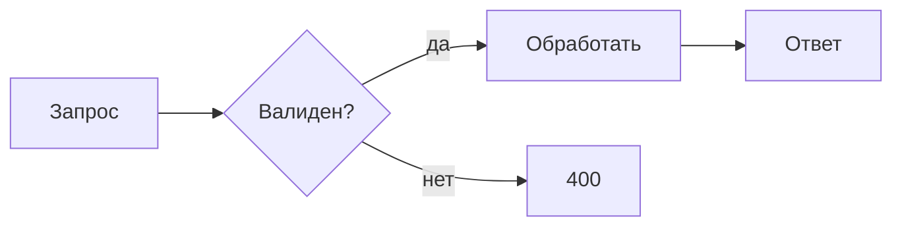
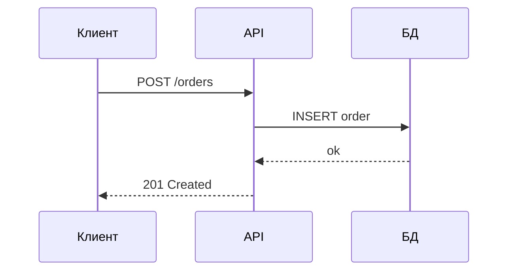
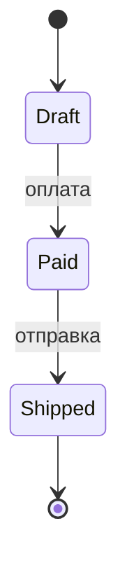
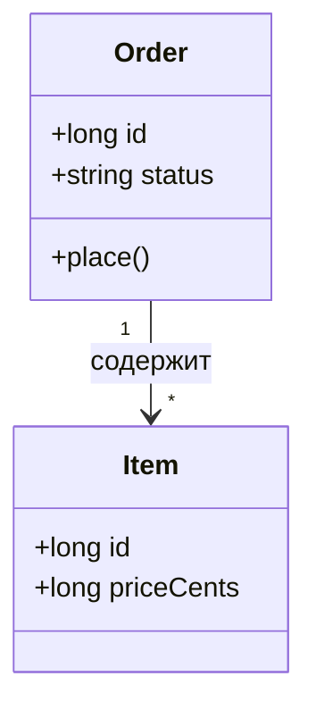
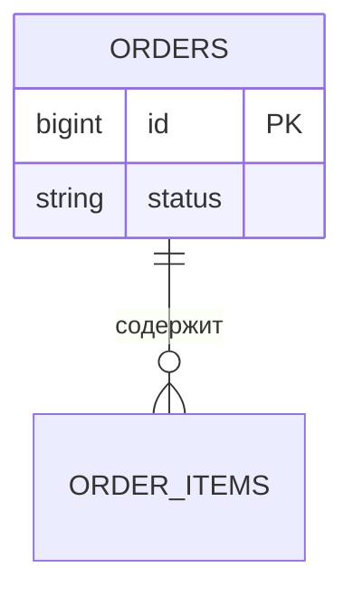
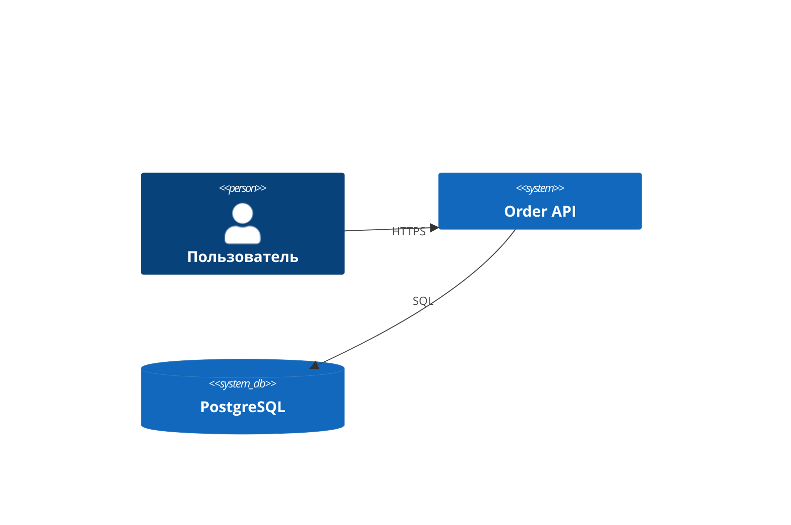

# Mermaid — диаграммы

**Когда использовать** — потоки, взаимодействия, модели, состояния: в README, `docs/`, ADR.
**Когда НЕ использовать** — объяснение «почему решили так» (это текст ADR), пиксельная графика (это дизайн-инструменты).

## Какая диаграмма для какой задачи

| Задача | Диаграмма | Пример |
|---|---|---|
| Процесс, пайплайн, ветвления | `flowchart` | CI-пайплайн, обработка запроса |
| Взаимодействие сервисов/API, жизненный цикл запроса | `sequenceDiagram` | клиент → API → БД |
| Доменная модель | `classDiagram` | сущности и связи |
| Машина состояний | `stateDiagram-v2` | заказ, платёж |
| Модель данных | `erDiagram` | таблицы и связи |
| Контекст системы (C4) | `C4Context` (mermaid ≥ 10) | система и её окружение |

## Примеры

### flowchart — процесс

### sequenceDiagram — взаимодействие

### stateDiagram — состояния

### classDiagram — модель

### erDiagram — данные

### C4Context — контекст системы (mermaid ≥ 10)

## Правила

1. **Одна диаграмма = одна идея**, 5–15 узлов; больше — разбить на несколько.
2. **Подписи — 1–3 слова**; детали — в тексте рядом, не в узлах.
3. **`subgraph`** — группировка (модули, сервисы, зоны).
4. **`direction`** — осознанно: `LR` для потоков, `TB` для иерархий.
5. **`sequenceDiagram`**: `alt/loop/opt` для ветвлений и повторов, `Note` для пояснений.
6. **Диаграмма + 2–3 предложения текста**: что показано, что важно, где детали.
7. **Проверять рендер**: GitHub рендерит mermaid в `.md` — смотреть результат, а не только синтаксис.

## Pitfalls

- **Спецсимволы в подписях ломают синтаксис**: `()`, `[]`, `"` — оборачивать подписи в кавычки: `A["Label (v2)"]`.
- **«Бог-диаграмма» на 40 узлов** — никто её не читает; разбить по идеям.
- **Диаграмма противоречит коду** — то же правило, что для текста: код побеждает, схему чинят в том же коммите.
- **C4 и новые типы** требуют mermaid ≥ 10; старые просмотрщики не отрендерят — не делать док зависимым от одной схемы.
- **Стилизация** (`classDef`, цвета) — зависит от темы рендера, устаревает, усложняет diff — по умолчанию не использовать.

## Правила (жёсткий слой)

- ✅ Диаграмма — для «как взаимодействуют / как течёт»; текст — для «почему решили так».
- ✅ Диаграмма с подписью в тексте (что она показывает).
- ❌ Диаграмма вместо ADR — решение не видно.
- ❌ Стилизация/цвета «для красоты».
- ❌ Диаграмма без рендер-проверки в целевом просмотрщике (GitHub/CI).

## Related

- [documentation.md](documentation.md) — принципы документирования
- [api-design.md](api-design.md) — контракты API
